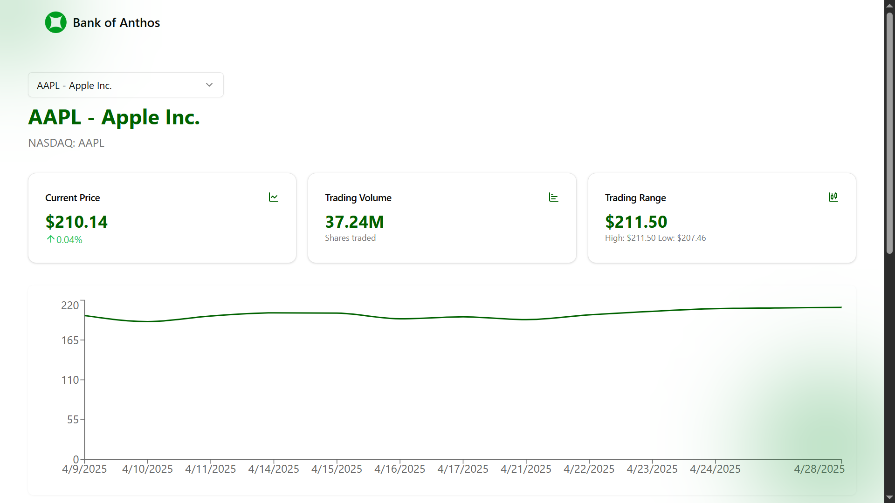

# Bank of Anthos

A modern, secure banking application built with Next.js, featuring real-time stock monitoring, seamless transactions, and personalized banking services.


_Modern banking interface 


_Real-time stock price monitoring

## Core Features

### 1. Personal Banking

- Secure account management
- Real-time balance tracking
- Instant money transfers
- Transaction history

### 2. Stock Market Integration

- Real-time stock price monitoring
- Market trend analysis
- Stock trading interface
- Historical data visualization

### 3. Security Features

- End-to-end encryption
- Secure session management
- Real-time security alerts

## Technical Stack

### Frontend

- **Framework**: Next.js 14
- **State Management**: React Query
- **Styling**: Tailwind CSS
- **Animations**: Framer Motion
- **Charts**: Recharts
- **UI Components**: shadcn/ui

### Security

- **Authentication**: Multi-factor authentication
- **Data Protection**: End-to-end encryption
- **Session Management**: Secure token handling

## Getting Started

1. Clone the repository:

```bash
git clone https://github.com/yourusername/bank-of-anthos.git
```

2. Install dependencies:

```bash
cd bank-of-anthos
npm install
```

3. Set up environment variables:

```bash
cp .env.example .env.local
```

4. Run the development server:

```bash
npm run dev
```

## Environment Setup

Required environment variables:

```env
NEXT_PUBLIC_API_URL=your_api_url
NEXT_PUBLIC_STOCK_API_KEY=your_stock_api_key
```

## Key Components

### Banking Dashboard

- Real-time account balance
- Recent transactions
- Quick transfer options
- Bill payment shortcuts

### Stock Market Interface

- Live stock prices
- Trading interface
- Market analysis tools

## Performance Features

- Server-side rendering for optimal performance
- Image optimization with Next.js
- Lazy loading for improved initial load time
- API response caching
- Progressive Web App capabilities

## Browser Support

- Chrome (latest)
- Firefox (latest)
- Safari (latest)
- Edge (latest)

## Contributing

1. Fork the repository
2. Create your feature branch: `git checkout -b feature/NewFeature`
3. Commit your changes: `git commit -m 'Add NewFeature'`
4. Push to the branch: `git push origin feature/NewFeature`
5. Submit a pull request

## License

This project is licensed under the MIT License - see the [LICENSE.md](LICENSE.md) file for details.

## Contact

For support or queries, please reach out to our team at support@bankofanthos.com
